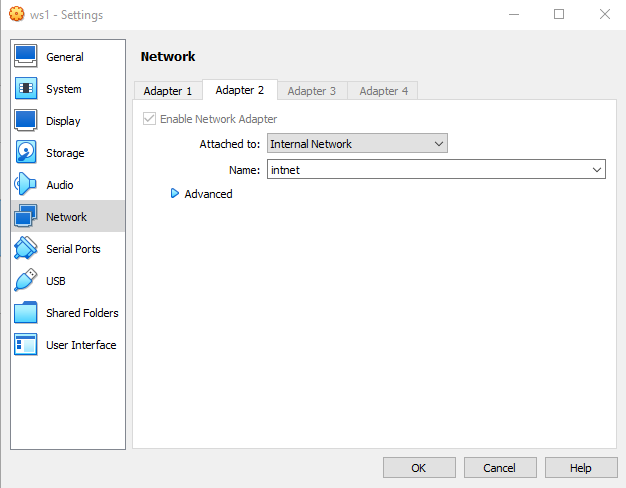
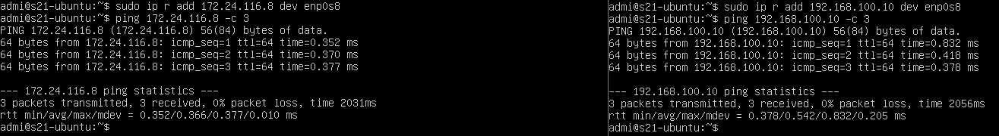
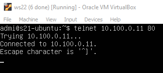

## Linux network.
Отчет о конфигурации сети в системе Linux.
<!-- <images src="./img/ubuntu_logo.png" alt="drawing" width="40"/>
 -->
## Содержание
1. [Part 1. Инструмент ipcalc](#part-1-installation-of-the-os)
2. [Part 2. Статическая маршрутизация между двумя машинами](#part-2-creating-a-user)
3. [Part 3. Утилита iperf3](#part-3-setting-up-the-os-network)
4. [Part 4. Сетевой брандмауэр](#part-4-os-update)
5. [Part 5. Статическая маршрутизация сети](#part-5-using-the-sudo-command)
6. [Part 6. Динамическая настройка IP с использованием DHCP](#part-6-installing-and-configuring-the-time-service)
7. [Part 7. NAT](#part-7-nat)
8. [Part 8. Бонус. Введение в SSH-туннели](#part-8-installing-and-basic-setup-of-the-sshd-service)

## Part 1. Инструмент ipcalc

* Если у вас не установлен ipcalc, запустите `sudo apt install ipcalc`.

### 1.1 Netwroks and Masks

1. 192.167.36.54/13 сетевой адрес:\


2. Преобразование маски 255.255.255.0 в префиксную и двоичную, /15 в обычную и двоичную, 11111111.11111111.11111111.11110000 в обычную и префиксную:

* 255.255.255.0 в префикс: /24 255.255.255.0 в двоичный файл: 11111111.11111111.11111111.00000000\


* /15 в обычный: 255.254.0.0 /15 в двоичный: 11111111.11111110.00000000.00000000\


* 1111111111.11111111.1111.11110000 до нормального состояния: 255.255.255.240 11111111.11111111.1111.1111.11110000 до префикса: /28


3. Минимальный и максимальный хост в сети 12.167.38.4 с масками: /8, 11111111.11111111.00000000.00000000, 255.255.254.0 и /4:\


### 1.2 localhost

- 194.34.23.100 - нет
- 127.0.0.2 - да
- 127.1.0.1 - да
- 128.0.0.1 - нет

### 1.3 Диапазоны и сегменты сетей

1. Какие из перечисленных IP-адресов могут использоваться как общедоступные, а какие только как частные:

- 10.0.0.45 - private
- 134.43.0.2 - public
- 192.168.4.2 - private
- 172.20.250.4 - private
- 172.0.2.1 - public
- 192.172.0.1 - public
- 172.68.0.2 - public
- 172.16.255.255 - private
- 10.10.10.10 - private
- 192.169.168.1 - public

2. Какие из перечисленных IP - адресов шлюза возможны для сети 10.10.0.0/18:

- 10.0.0.1 - нет
- 10.10.0.2 - да
- 10.10.10.10 - да
- 10.10.100.1 - нет
- 10.10.1.255 - да

## Part 2. Статическая маршрутизация между двумя машинами

* Для этой задачи важно клонировать виртуальную машину и установить внутреннюю сеть на обоих:\


* Вывод `ip a`:\


* Чтобы проложить сеть между машинами, нам нужно настроить netplan с помощью running `mcedit /etc/netplan/00-installer-config.yaml`:


* Запустите `sudo netplan apply`, чтобы применить настройки на обеих машинах:\


### 2.1. Добавление статического маршрута вручную

* Для ручной настройки статического маршрута выполните `ip r add [ip of another machine] dev enp0s8`:


Как показано на скриншоте, компьютеры успешно обмениваются данными друг с другом.

### 2.2. Добавление статического маршрута с сохранением

* Запустите `mcedit /etc/netplan/00-installer-config.yaml` и добавьте маршруты, подобные этому: 
 

* Повторное применение настроек и проверка ping:\


## Part 3. Утилита iperf3
### 3.1 Скорость соединения
``` brew
8Mbps == 1MB/s;
100MB/s == 800000 Kbps;
1Gbps == 1000 Mbps.
``` 

### 3.2 Утилита iperf3

* Чтобы проверить скорость соединения через iperf3, запустите::
``` brew
sudo iperf3 -s
``` 
на ws1;
``` brew
sudo iperf3 -c 192.168.100.10
``` 
на ws2.


## Part 4. Сетевой брандмауэр
### 4.1 Утилита iptables

* Если еще не установлен, запустите `sudo apt install iptables`.

* Создайте брандмауэр /etc/.файл sh, имитирующий брандмауэр на ws1 и ws2:


* Запустите файлы на обеих машинах с помощью chmod +x /etc/firewall.sh и /etc/firewall.команды sh:

    Разница между стратегиями, используемыми в первом и втором файлах, заключается в том, что мы сначала настроили drop на ws1, поэтому этот компьютер не может быть пропингован.

### 4.2 Утилита nmap


Как видно на скриншоте, ws1 не отвечает на запросы, хотя его хост запущен, как мы проверили с помощью nmap.

## Part 5. Статическая маршрутизация сети

* Запустите пять виртуальных машин (3 рабочие станции (ws11, ws21, ws22) и 2 маршрутизатора (r1, r2))

* В настройках виртуальной машины настройте сеть должным образом:

    - Для r1: `Adapter 1 (Internal Network, r1-ws11), Adapter 2 (Internal Network, r1-r2), Adapter 3 (NAT)`
    - Для r2: `Adapter 1 (Internal Network, r1-r2), Adapter 2 (Internal Network, r2-ws21-ws22), Adapter 3 (NAT)`
    - Для ws11: `Adapter 1 (Internal Network, r1-ws11), Adapter 2 (NAT)`
    - Для ws21, ws22: `Adapter 1 (Internal Network, r2-ws21-ws22), Adapter 2 (NAT)`

### 5.1. Настройка адресов компьютеров

* Настройте конфигурации компьютера в etc/netplan/00-installer-config.yaml в соответствии со скриншотами:

*r1*


*r2*


*ws11*


*ws21*


*ws22*


* Перезапустите сетевую службу через `sudo netplan apply`.

* Проверьте правильность адреса компьютера с помощью команды `ip -4 a`.

*r1*


*r2*


*ws22*


* Ping ws22 из ws21:\


* Ping r1 из ws11:\


### 5.2. Включение переадресации IP

* Чтобы включить переадресацию IP, выполните следующую команду на маршрутизаторах:
`sysctl -w net.ipv4.ip_forward=1`.

    *При таком подходе переадресация не будет работать после перезагрузки системы.*

Откройте файл /etc/sysctl.conf и раскомментируйте следующую строку:
`net.ipv4.ip_forward = 1`.

    *При таком подходе переадресация IP-адресов включена постоянно.*

### 5.3. Конфигурация маршрута по умолчанию

* Настройте маршрут (шлюз) по умолчанию для рабочих станций. Для этого добавьте routes перед IP маршрутизатора в файле конфигурации:

    -*ws11*
    

    -*ws21*
    

    -*ws22*
    

* Примените с помощью `sudo netplan apply` и проверьте, сработало ли это с `ip r`:
    

* Ping ws11 -> r2:
    

### 5.4. Добавление статических маршрутов

* Добавить статические маршруты в r1 и r2 в файле конфигурации:

    -*r1*
    

    -*r2*
    

* Вызовите ip r и покажите таблицы маршрутов на обоих маршрутизаторах:


* Запустите команды ip r list 10.10.0.0/[netmask] и ip r list 0.0.0.0/ 0 на ws11:


* Объясните в отчете, почему для 10.10.0.0/[netmask] был выбран другой маршрут, отличный от 0.0.0.0/0, хотя это мог быть маршрут по умолчанию.
    ```
    Адрес 0.0.0.0/0 обычно означает "любой адрес", следовательно, команда ipr list 0.0.0.0/0 выведет все маршруты, доступные на этом устройстве. Результат команды ip r list 10.10.0.0/18 будет отличаться, поскольку этот адрес уже есть в сети устройства, и нет необходимости обращаться к маршрутизатору для дальнейшей передачи пакета.
    ```

### 5.5. Составление списка маршрутизаторов

* Запустите команду дампа tcpdump -tnv -i enp0s3 на r1


* Используйте утилиту traceroute для составления списка маршрутизаторов по пути ws11 -> ws21
    ```
    traceroute 10.20.0.10
    ```


### 5.6. Использование протокола ICMP при маршрутизации

* Запустите на r1 сбор сетевого трафика, проходящего через eth0, с помощью  `tcpdump -n -i enp0s3` команды icmp.

    ```
    tcpdump -tn -i enp0s3
    ```


* Пропингуйте несуществующий IP (например, 10.30.0.111) из ws11 с помощью`ping -c 1 10.30.0.111` команды.

    ```
    ping -c 1 10.30.0.111
    ```


## Part 6. Динамическая настройка IP с использованием DHCP

* Укажите адрес маршрутизатора по умолчанию, DNS-сервер и адрес внутренней сети. Вот пример файла для r2:

    ```
    sudo mcedit /etc/dhcp/dhcpd.conf
    ```

    


* Определите сервер имен как `8.8.8.8` в resolv.conf:

    ```
    sudo mcedit /etc/resolv.conf
    ```

    


* Перезапустите службу DHCP:

    ```
    systemctl restart isc-dhcp-server
    ```

    

    - Ping ws21->ws22:

    


* Настройте MAC-адрес ws11 в настройках виртуальной машины и в netplan: 

    

    


* Настройте r1 так же, как r2, но сделайте назначение адресов строго привязанным к MAC-адресу (ws11). Запустите те же тесты:

    ```
    sudo mcedit /etc/dhcp/dhcpd.conf
    ```

    

    ```
    sudo mcedit /etc/resolv.conf
    ```

    

    ```
    systemctl restart isc-dhcp-server
    ```

    

    Новый IP-адрес ws11:

    


* Запросить обновление ip -адреса у ws21:

    - Запустите `sudo dhclient -r enp0s3`,  чтобы удалить старый ip.

    - Запустите `sudo dhclient -v enp0s3`, чтобы запросить новый ip 

    Перед обновлением:
    
    

    После обновления:

    


## Part 7. NAT

* В файле /etc/apache2/ports.conf измените строку Listen 80 на Listen 0.0.0.0:80 на ws22 и r1, т.е. сделайте сервер Apache2 общедоступным:

    ```
    sudo mcedit /etc/apache2/ports.conf
    ```
    


* Запустите веб - сервер Apache с помощью service apache2 start команды на ws22 и r1:

    


* Добавьте следующие правила в брандмауэр, созданный аналогично брандмауэру из части 4, на r2:

    1) удалить правила в таблице фильтров - iptables -F

    2) удалить правила в таблице "NAT" - iptables -F -t nat

    3) удалить все маршрутизируемые пакеты - iptables --политика ПРЯМОГО УДАЛЕНИЯ

    

* Запустите файл:

    

    *При запуске файла с этими правилами ws22 не должен выполнять пинг с r1*

* Ping w22->r1:

    

    *Как видно на скриншоте, до обновления брандмауэра ping работал просто отлично. Теперь брандмауэр блокирует его..*

* Добавьте в файл еще одно правило:

    разрешить маршрутизацию всех пакетов протокола ICMP

    

* Запустите файл:

    

* Проверьте соединение между ws22 и r1 с помощью команды `ping`:

    

* Добавьте в файл еще два правила:

   включить SNAT, который маскирует все локальные ip-адреса из локальной сети за r2 (как определено в части 5 - сеть 10.20.0.0)
    ```
    Tip: стоит подумать о маршрутизации внутренних пакетов, а также внешних пакетов с установленным соединением
    ```

    включите DNAT на порту 8080 компьютера r2 и добавьте внешний сетевой доступ к веб -серверу Apache, работающему на ws22
    ```
    Tip: имейте в виду, что при попытке подключения появится новое tcp-соединение для ws22 и порта 80
    ```

    

* Проверьте TCP-соединение на наличие SNAT, подключившись из ws22 к серверу Apache на r1 с помощью команды telnet [address] [port]:

    

* Проверьте TCP-соединение на наличие DNAT, подключившись с r1 к серверу Apache на ws22 с помощью команды telnet (адрес r2 и порт 8080):

    


## Part 8. Бонус. Введение в SSH-туннели

* Запустите брандмауэр на r2 с правилами из части 7:

    

* Запустите веб-сервер Apapche на ws22 только на localhost (т.е. В файле /etc/apache2/ports.conf измените строку Listen 80 на Listen localhost:80)

    

* Используйте локальную переадресацию TCP с ws21 на ws22 для доступа к веб-серверу на ws22 из ws21:

    

* Используйте удаленную переадресацию TCP с ws11 на ws22 для доступа к веб-серверу на ws22 из ws11:

    

* Чтобы проверить, работало ли соединение на обоих предыдущих этапах, перейдите ко второму терминалу (например, с помощью Alt + F2) и запустите `telnet 127.0.0.1 [local port]` команду:

    